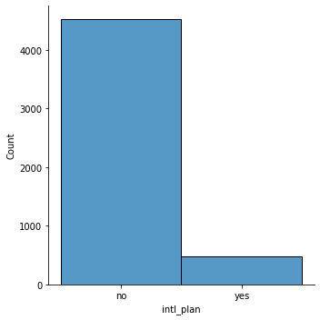

'''
 This project utilizes supervised learning models to identify 
 customers who are likely to cancel service in the near future.
 Also, extract and analyze top factors that contribute to user retention
'''


### Part 1 - Data Exploration 

#### 1.1 Load & understand the dataset


```python
import pandas as pd
import numpy as np
import imblearn
import warnings
warnings.filterwarnings('ignore')

# to show all the columns
pd.set_option('display.max_columns', None)

data = pd.read_csv('../data/churn.all')
data.head()
```


<div>
<style scoped>
    .dataframe tbody tr th:only-of-type {
        vertical-align: middle;
    }

    .dataframe tbody tr th {
        vertical-align: top;
    }

    .dataframe thead th {
        text-align: right;
    }
</style>
<table border="1" class="dataframe">
  <thead>
    <tr style="text-align: right;">
      <th></th>
      <th>state</th>
      <th>account_length</th>
      <th>area_code</th>
      <th>phone_number</th>
      <th>intl_plan</th>
      <th>voice_mail_plan</th>
      <th>number_vmail_messages</th>
      <th>total_day_minutes</th>
      <th>total_day_calls</th>
      <th>total_day_charge</th>
      <th>total_eve_minutes</th>
      <th>total_eve_calls</th>
      <th>total_eve_charge</th>
      <th>total_night_minutes</th>
      <th>total_night_calls</th>
      <th>total_night_charge</th>
      <th>total_intl_minutes</th>
      <th>total_intl_calls</th>
      <th>total_intl_charge</th>
      <th>number_customer_service_calls</th>
      <th>churned</th>
    </tr>
  </thead>
  <tbody>
    <tr>
      <th>0</th>
      <td>KS</td>
      <td>128</td>
      <td>415</td>
      <td>382-4657</td>
      <td>no</td>
      <td>yes</td>
      <td>25</td>
      <td>265.1</td>
      <td>110</td>
      <td>45.07</td>
      <td>197.4</td>
      <td>99</td>
      <td>16.78</td>
      <td>244.7</td>
      <td>91</td>
      <td>11.01</td>
      <td>10.0</td>
      <td>3</td>
      <td>2.70</td>
      <td>1</td>
      <td>False.</td>
    </tr>
    <tr>
      <th>1</th>
      <td>OH</td>
      <td>107</td>
      <td>415</td>
      <td>371-7191</td>
      <td>no</td>
      <td>yes</td>
      <td>26</td>
      <td>161.6</td>
      <td>123</td>
      <td>27.47</td>
      <td>195.5</td>
      <td>103</td>
      <td>16.62</td>
      <td>254.4</td>
      <td>103</td>
      <td>11.45</td>
      <td>13.7</td>
      <td>3</td>
      <td>3.70</td>
      <td>1</td>
      <td>False.</td>
    </tr>
    <tr>
      <th>2</th>
      <td>NJ</td>
      <td>137</td>
      <td>415</td>
      <td>358-1921</td>
      <td>no</td>
      <td>no</td>
      <td>0</td>
      <td>243.4</td>
      <td>114</td>
      <td>41.38</td>
      <td>121.2</td>
      <td>110</td>
      <td>10.30</td>
      <td>162.6</td>
      <td>104</td>
      <td>7.32</td>
      <td>12.2</td>
      <td>5</td>
      <td>3.29</td>
      <td>0</td>
      <td>False.</td>
    </tr>
    <tr>
      <th>3</th>
      <td>OH</td>
      <td>84</td>
      <td>408</td>
      <td>375-9999</td>
      <td>yes</td>
      <td>no</td>
      <td>0</td>
      <td>299.4</td>
      <td>71</td>
      <td>50.90</td>
      <td>61.9</td>
      <td>88</td>
      <td>5.26</td>
      <td>196.9</td>
      <td>89</td>
      <td>8.86</td>
      <td>6.6</td>
      <td>7</td>
      <td>1.78</td>
      <td>2</td>
      <td>False.</td>
    </tr>
    <tr>
      <th>4</th>
      <td>OK</td>
      <td>75</td>
      <td>415</td>
      <td>330-6626</td>
      <td>yes</td>
      <td>no</td>
      <td>0</td>
      <td>166.7</td>
      <td>113</td>
      <td>28.34</td>
      <td>148.3</td>
      <td>122</td>
      <td>12.61</td>
      <td>186.9</td>
      <td>121</td>
      <td>8.41</td>
      <td>10.1</td>
      <td>3</td>
      <td>2.73</td>
      <td>3</td>
      <td>False.</td>
    </tr>
  </tbody>
</table>
</div>


```python
# shape of the dataset
print('number of rows: {} and columns: {}'.format(data.shape[0], data.shape[1]))
```

    number of rows: 5000 and columns: 21


#### 1.2 Data cleaning


```python
# remove unnecessary whitespaces among features that we are about to use
print('before:' + str(data['voice_mail_plan'][0]))
print('before:' + str(data['intl_plan'][0]))
print('before:' + str(data['churned'][0]))
```

    before: yes
    before: no
    before: False.


```python
# print(data['voice_mail_plan'])
```


```python
# remove heading and trailing whitespaces
data['voice_mail_plan'] = data['voice_mail_plan'].map(lambda x : x.strip())
data['intl_plan'] = data['intl_plan'].map(lambda x : x.strip())
data['churned'] = data['churned'].map(lambda x : x.strip())
```


```python
print('after:' + str(data['voice_mail_plan'][0]))
print('after:' + str(data['intl_plan'][0]))
print('after:' + str(data['churned'][0]))
```

    after:yes
    after:no
    after:False.


#### 1.3 Explore features


```python
# plot feature values to show distribution
%matplotlib inline
import matplotlib.pyplot as plt
import seaborn as sns

sns.displot(data['intl_plan'])
sns.displot(data['total_night_charge'])
sns.displot(data['number_customer_service_calls'])
```


    <seaborn.axisgrid.FacetGrid at 0x7fcd8d285580>


```python
# calculate the Pearson correlations between all continuous features
pcorr = data[["account_length", "number_vmail_messages", "total_eve_calls", "total_day_minutes",
                    "total_day_calls", "total_day_charge", "total_eve_minutes",
                     "total_eve_charge", "total_night_minutes",
                    "total_night_calls", "total_intl_minutes", "total_intl_calls",
                    "total_intl_charge"]].corr()
# print(pcorr)
fig, ax = plt.subplots(figsize=(22,12))
sns.heatmap(pcorr, annot=True, fmt=".3f", cmap="coolwarm", ax=ax)
```


    <AxesSubplot:>





### Part 2 - Feature Preprocessing


```python
# calculate pearson correlation between two features
from scipy.stats import pearsonr
# linear correlation
print (pearsonr(data['total_intl_minutes'], data['total_intl_charge'])[0])
# no linear correlation
print (pearsonr(data['total_intl_minutes'], data['total_night_calls'])[0])
```

    0.9999926570208368
    0.0003907572996283259


```python
# get true Y output - ground truth
Y = np.where(data['churned'] == 'True.', 1, 0)

# drop unnecessary features
data_train = data.drop(['state','area_code','phone_number','churned'], axis = 1)

# convert categorical features into boolean values
data_train[["intl_plan","voice_mail_plan"]] = data_train[["intl_plan","voice_mail_plan"]] == 'yes'
X = data_train
```


```python
#print(X_train)
```


```python
# check the propotion of churned customers
print('{}%'.format((Y.sum() / Y.shape * 100)[0]))
```

    14.14%


```python
X.head()
```


<div>
<style scoped>
    .dataframe tbody tr th:only-of-type {
        vertical-align: middle;
    }

    .dataframe tbody tr th {
        vertical-align: top;
    }

    .dataframe thead th {
        text-align: right;
    }
</style>
<table border="1" class="dataframe">
  <thead>
    <tr style="text-align: right;">
      <th></th>
      <th>account_length</th>
      <th>intl_plan</th>
      <th>voice_mail_plan</th>
      <th>number_vmail_messages</th>
      <th>total_day_minutes</th>
      <th>total_day_calls</th>
      <th>total_day_charge</th>
      <th>total_eve_minutes</th>
      <th>total_eve_calls</th>
      <th>total_eve_charge</th>
      <th>total_night_minutes</th>
      <th>total_night_calls</th>
      <th>total_night_charge</th>
      <th>total_intl_minutes</th>
      <th>total_intl_calls</th>
      <th>total_intl_charge</th>
      <th>number_customer_service_calls</th>
    </tr>
  </thead>
  <tbody>
    <tr>
      <th>0</th>
      <td>128</td>
      <td>False</td>
      <td>True</td>
      <td>25</td>
      <td>265.1</td>
      <td>110</td>
      <td>45.07</td>
      <td>197.4</td>
      <td>99</td>
      <td>16.78</td>
      <td>244.7</td>
      <td>91</td>
      <td>11.01</td>
      <td>10.0</td>
      <td>3</td>
      <td>2.70</td>
      <td>1</td>
    </tr>
    <tr>
      <th>1</th>
      <td>107</td>
      <td>False</td>
      <td>True</td>
      <td>26</td>
      <td>161.6</td>
      <td>123</td>
      <td>27.47</td>
      <td>195.5</td>
      <td>103</td>
      <td>16.62</td>
      <td>254.4</td>
      <td>103</td>
      <td>11.45</td>
      <td>13.7</td>
      <td>3</td>
      <td>3.70</td>
      <td>1</td>
    </tr>
    <tr>
      <th>2</th>
      <td>137</td>
      <td>False</td>
      <td>False</td>
      <td>0</td>
      <td>243.4</td>
      <td>114</td>
      <td>41.38</td>
      <td>121.2</td>
      <td>110</td>
      <td>10.30</td>
      <td>162.6</td>
      <td>104</td>
      <td>7.32</td>
      <td>12.2</td>
      <td>5</td>
      <td>3.29</td>
      <td>0</td>
    </tr>
    <tr>
      <th>3</th>
      <td>84</td>
      <td>True</td>
      <td>False</td>
      <td>0</td>
      <td>299.4</td>
      <td>71</td>
      <td>50.90</td>
      <td>61.9</td>
      <td>88</td>
      <td>5.26</td>
      <td>196.9</td>
      <td>89</td>
      <td>8.86</td>
      <td>6.6</td>
      <td>7</td>
      <td>1.78</td>
      <td>2</td>
    </tr>
    <tr>
      <th>4</th>
      <td>75</td>
      <td>True</td>
      <td>False</td>
      <td>0</td>
      <td>166.7</td>
      <td>113</td>
      <td>28.34</td>
      <td>148.3</td>
      <td>122</td>
      <td>12.61</td>
      <td>186.9</td>
      <td>121</td>
      <td>8.41</td>
      <td>10.1</td>
      <td>3</td>
      <td>2.73</td>
      <td>3</td>
    </tr>
  </tbody>
</table>
</div>


```python
# Encode and add categorical features (state)
data_encode_add = data.drop(['area_code', 'phone_number', 'churned'], axis = 1)

# convert categorical features into boolean values
data_encode_add[['intl_plan', 'voice_mail_plan']] = data_encode_add[['intl_plan', 'voice_mail_plan']] == 'yes'

# encode feature
data_encode_add = pd.get_dummies(data_encode_add, columns=['state'])

data_encode_add.head()
```


<div>
<style scoped>
    .dataframe tbody tr th:only-of-type {
        vertical-align: middle;
    }

    .dataframe tbody tr th {
        vertical-align: top;
    }

    .dataframe thead th {
        text-align: right;
    }
</style>
<table border="1" class="dataframe">
  <thead>
    <tr style="text-align: right;">
      <th></th>
      <th>account_length</th>
      <th>intl_plan</th>
      <th>voice_mail_plan</th>
      <th>number_vmail_messages</th>
      <th>total_day_minutes</th>
      <th>total_day_calls</th>
      <th>total_day_charge</th>
      <th>total_eve_minutes</th>
      <th>total_eve_calls</th>
      <th>total_eve_charge</th>
      <th>total_night_minutes</th>
      <th>total_night_calls</th>
      <th>total_night_charge</th>
      <th>total_intl_minutes</th>
      <th>total_intl_calls</th>
      <th>total_intl_charge</th>
      <th>number_customer_service_calls</th>
      <th>state_AK</th>
      <th>state_AL</th>
      <th>state_AR</th>
      <th>state_AZ</th>
      <th>state_CA</th>
      <th>state_CO</th>
      <th>state_CT</th>
      <th>state_DC</th>
      <th>state_DE</th>
      <th>state_FL</th>
      <th>state_GA</th>
      <th>state_HI</th>
      <th>state_IA</th>
      <th>state_ID</th>
      <th>state_IL</th>
      <th>state_IN</th>
      <th>state_KS</th>
      <th>state_KY</th>
      <th>state_LA</th>
      <th>state_MA</th>
      <th>state_MD</th>
      <th>state_ME</th>
      <th>state_MI</th>
      <th>state_MN</th>
      <th>state_MO</th>
      <th>state_MS</th>
      <th>state_MT</th>
      <th>state_NC</th>
      <th>state_ND</th>
      <th>state_NE</th>
      <th>state_NH</th>
      <th>state_NJ</th>
      <th>state_NM</th>
      <th>state_NV</th>
      <th>state_NY</th>
      <th>state_OH</th>
      <th>state_OK</th>
      <th>state_OR</th>
      <th>state_PA</th>
      <th>state_RI</th>
      <th>state_SC</th>
      <th>state_SD</th>
      <th>state_TN</th>
      <th>state_TX</th>
      <th>state_UT</th>
      <th>state_VA</th>
      <th>state_VT</th>
      <th>state_WA</th>
      <th>state_WI</th>
      <th>state_WV</th>
      <th>state_WY</th>
    </tr>
  </thead>
  <tbody>
    <tr>
      <th>0</th>
      <td>128</td>
      <td>False</td>
      <td>True</td>
      <td>25</td>
      <td>265.1</td>
      <td>110</td>
      <td>45.07</td>
      <td>197.4</td>
      <td>99</td>
      <td>16.78</td>
      <td>244.7</td>
      <td>91</td>
      <td>11.01</td>
      <td>10.0</td>
      <td>3</td>
      <td>2.70</td>
      <td>1</td>
      <td>0</td>
      <td>0</td>
      <td>0</td>
      <td>0</td>
      <td>0</td>
      <td>0</td>
      <td>0</td>
      <td>0</td>
      <td>0</td>
      <td>0</td>
      <td>0</td>
      <td>0</td>
      <td>0</td>
      <td>0</td>
      <td>0</td>
      <td>0</td>
      <td>1</td>
      <td>0</td>
      <td>0</td>
      <td>0</td>
      <td>0</td>
      <td>0</td>
      <td>0</td>
      <td>0</td>
      <td>0</td>
      <td>0</td>
      <td>0</td>
      <td>0</td>
      <td>0</td>
      <td>0</td>
      <td>0</td>
      <td>0</td>
      <td>0</td>
      <td>0</td>
      <td>0</td>
      <td>0</td>
      <td>0</td>
      <td>0</td>
      <td>0</td>
      <td>0</td>
      <td>0</td>
      <td>0</td>
      <td>0</td>
      <td>0</td>
      <td>0</td>
      <td>0</td>
      <td>0</td>
      <td>0</td>
      <td>0</td>
      <td>0</td>
      <td>0</td>
    </tr>
    <tr>
      <th>1</th>
      <td>107</td>
      <td>False</td>
      <td>True</td>
      <td>26</td>
      <td>161.6</td>
      <td>123</td>
      <td>27.47</td>
      <td>195.5</td>
      <td>103</td>
      <td>16.62</td>
      <td>254.4</td>
      <td>103</td>
      <td>11.45</td>
      <td>13.7</td>
      <td>3</td>
      <td>3.70</td>
      <td>1</td>
      <td>0</td>
      <td>0</td>
      <td>0</td>
      <td>0</td>
      <td>0</td>
      <td>0</td>
      <td>0</td>
      <td>0</td>
      <td>0</td>
      <td>0</td>
      <td>0</td>
      <td>0</td>
      <td>0</td>
      <td>0</td>
      <td>0</td>
      <td>0</td>
      <td>0</td>
      <td>0</td>
      <td>0</td>
      <td>0</td>
      <td>0</td>
      <td>0</td>
      <td>0</td>
      <td>0</td>
      <td>0</td>
      <td>0</td>
      <td>0</td>
      <td>0</td>
      <td>0</td>
      <td>0</td>
      <td>0</td>
      <td>0</td>
      <td>0</td>
      <td>0</td>
      <td>0</td>
      <td>1</td>
      <td>0</td>
      <td>0</td>
      <td>0</td>
      <td>0</td>
      <td>0</td>
      <td>0</td>
      <td>0</td>
      <td>0</td>
      <td>0</td>
      <td>0</td>
      <td>0</td>
      <td>0</td>
      <td>0</td>
      <td>0</td>
      <td>0</td>
    </tr>
    <tr>
      <th>2</th>
      <td>137</td>
      <td>False</td>
      <td>False</td>
      <td>0</td>
      <td>243.4</td>
      <td>114</td>
      <td>41.38</td>
      <td>121.2</td>
      <td>110</td>
      <td>10.30</td>
      <td>162.6</td>
      <td>104</td>
      <td>7.32</td>
      <td>12.2</td>
      <td>5</td>
      <td>3.29</td>
      <td>0</td>
      <td>0</td>
      <td>0</td>
      <td>0</td>
      <td>0</td>
      <td>0</td>
      <td>0</td>
      <td>0</td>
      <td>0</td>
      <td>0</td>
      <td>0</td>
      <td>0</td>
      <td>0</td>
      <td>0</td>
      <td>0</td>
      <td>0</td>
      <td>0</td>
      <td>0</td>
      <td>0</td>
      <td>0</td>
      <td>0</td>
      <td>0</td>
      <td>0</td>
      <td>0</td>
      <td>0</td>
      <td>0</td>
      <td>0</td>
      <td>0</td>
      <td>0</td>
      <td>0</td>
      <td>0</td>
      <td>0</td>
      <td>1</td>
      <td>0</td>
      <td>0</td>
      <td>0</td>
      <td>0</td>
      <td>0</td>
      <td>0</td>
      <td>0</td>
      <td>0</td>
      <td>0</td>
      <td>0</td>
      <td>0</td>
      <td>0</td>
      <td>0</td>
      <td>0</td>
      <td>0</td>
      <td>0</td>
      <td>0</td>
      <td>0</td>
      <td>0</td>
    </tr>
    <tr>
      <th>3</th>
      <td>84</td>
      <td>True</td>
      <td>False</td>
      <td>0</td>
      <td>299.4</td>
      <td>71</td>
      <td>50.90</td>
      <td>61.9</td>
      <td>88</td>
      <td>5.26</td>
      <td>196.9</td>
      <td>89</td>
      <td>8.86</td>
      <td>6.6</td>
      <td>7</td>
      <td>1.78</td>
      <td>2</td>
      <td>0</td>
      <td>0</td>
      <td>0</td>
      <td>0</td>
      <td>0</td>
      <td>0</td>
      <td>0</td>
      <td>0</td>
      <td>0</td>
      <td>0</td>
      <td>0</td>
      <td>0</td>
      <td>0</td>
      <td>0</td>
      <td>0</td>
      <td>0</td>
      <td>0</td>
      <td>0</td>
      <td>0</td>
      <td>0</td>
      <td>0</td>
      <td>0</td>
      <td>0</td>
      <td>0</td>
      <td>0</td>
      <td>0</td>
      <td>0</td>
      <td>0</td>
      <td>0</td>
      <td>0</td>
      <td>0</td>
      <td>0</td>
      <td>0</td>
      <td>0</td>
      <td>0</td>
      <td>1</td>
      <td>0</td>
      <td>0</td>
      <td>0</td>
      <td>0</td>
      <td>0</td>
      <td>0</td>
      <td>0</td>
      <td>0</td>
      <td>0</td>
      <td>0</td>
      <td>0</td>
      <td>0</td>
      <td>0</td>
      <td>0</td>
      <td>0</td>
    </tr>
    <tr>
      <th>4</th>
      <td>75</td>
      <td>True</td>
      <td>False</td>
      <td>0</td>
      <td>166.7</td>
      <td>113</td>
      <td>28.34</td>
      <td>148.3</td>
      <td>122</td>
      <td>12.61</td>
      <td>186.9</td>
      <td>121</td>
      <td>8.41</td>
      <td>10.1</td>
      <td>3</td>
      <td>2.73</td>
      <td>3</td>
      <td>0</td>
      <td>0</td>
      <td>0</td>
      <td>0</td>
      <td>0</td>
      <td>0</td>
      <td>0</td>
      <td>0</td>
      <td>0</td>
      <td>0</td>
      <td>0</td>
      <td>0</td>
      <td>0</td>
      <td>0</td>
      <td>0</td>
      <td>0</td>
      <td>0</td>
      <td>0</td>
      <td>0</td>
      <td>0</td>
      <td>0</td>
      <td>0</td>
      <td>0</td>
      <td>0</td>
      <td>0</td>
      <td>0</td>
      <td>0</td>
      <td>0</td>
      <td>0</td>
      <td>0</td>
      <td>0</td>
      <td>0</td>
      <td>0</td>
      <td>0</td>
      <td>0</td>
      <td>0</td>
      <td>1</td>
      <td>0</td>
      <td>0</td>
      <td>0</td>
      <td>0</td>
      <td>0</td>
      <td>0</td>
      <td>0</td>
      <td>0</td>
      <td>0</td>
      <td>0</td>
      <td>0</td>
      <td>0</td>
      <td>0</td>
      <td>0</td>
    </tr>
  </tbody>
</table>
</div>


### Part 3 : Model Training and Evaluation
#### 3.1 Split data


```python
# train & test split
from sklearn.model_selection import train_test_split

# 25% for testing
X_train, X_test, Y_train, Y_test = train_test_split(X, Y, test_size = 0.25)

print('training data has %d rows and %d columns' % X_train.shape)
print('testing data has %d rows and %d columns' % X_test.shape)
```

    training data has 3750 rows and 17 columns
    testing data has 1250 rows and 17 columns


```python
# data normalization
from sklearn.preprocessing import StandardScaler

scaler = StandardScaler()
X_train = scaler.fit_transform(X_train)
X_test = scaler.fit_transform(X_test)
```

#### 3.2 Model selection


```python
# evaluate and compare the different classifiers using cross-validated ROC-AUC 
from xgboost import  XGBClassifier
from sklearn.svm import SVC
from sklearn.model_selection import GridSearchCV, cross_val_score, StratifiedKFold, learning_curve
from sklearn.ensemble import RandomForestClassifier, AdaBoostClassifier, GradientBoostingClassifier
from sklearn.neighbors import KNeighborsClassifier 
from sklearn.linear_model import LogisticRegression
from sklearn.naive_bayes import GaussianNB
from sklearn.tree import DecisionTreeClassifier

```


```python
# building a K-fold cross validation
kfold_cv = StratifiedKFold(n_splits=5)
random_state = 55
clfs = [SVC(random_state=random_state), 
      RandomForestClassifier(random_state=random_state),
      AdaBoostClassifier(n_estimators=100, random_state=random_state, learning_rate=0.5),
      GradientBoostingClassifier(random_state=random_state),
      KNeighborsClassifier(),
      LogisticRegression(random_state=random_state),
      XGBClassifier(random_state=random_state)]

cv_means = []
cv_std = []
for clf in clfs:
    cv_results = cross_val_score(clf, X_train, Y_train, scoring="roc_auc", cv = kfold_cv)
    cv_means.append(cv_results.mean())
    cv_std.append(cv_results.std())
    
cv_res = pd.DataFrame({"CV mean":cv_means,"CV std": cv_std,"Classifiers":["SVC","RandomForest","AdaBoost",
"GradientBoosting","KNeighboors","LogisticRegression","XGBoost"]})

sns.set_palette("Set2")
graph = sns.barplot(x='CV mean', y='Classifiers', data= cv_res, orient='h')
print(cv_res)
```

        CV mean    CV std         Classifiers
    0  0.910164  0.012292                 SVC
    1  0.913549  0.018490        RandomForest
    2  0.861596  0.033340            AdaBoost
    3  0.915992  0.024136    GradientBoosting
    4  0.835739  0.015323         KNeighboors
    5  0.825327  0.018453  LogisticRegression
    6  0.920703  0.019690             XGBoost


```python

```
